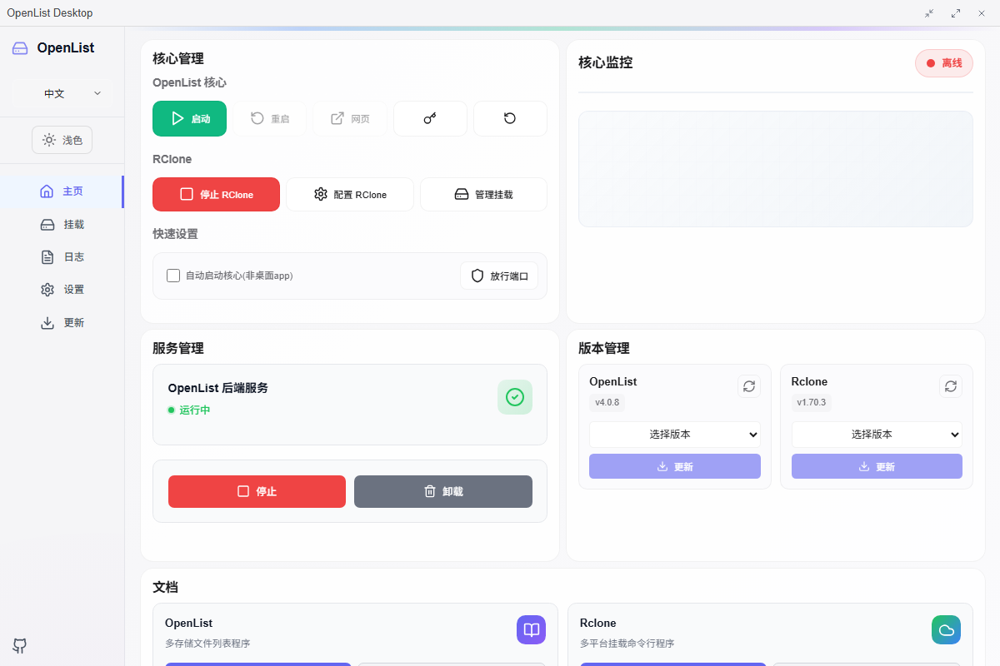
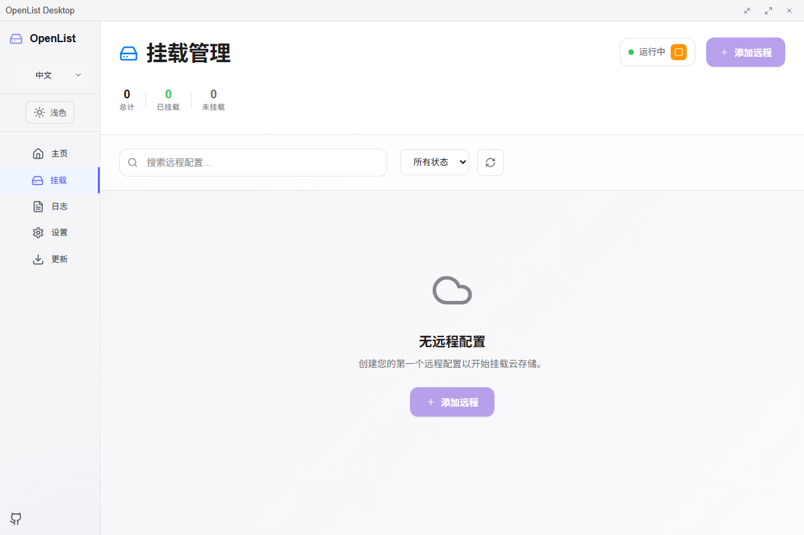
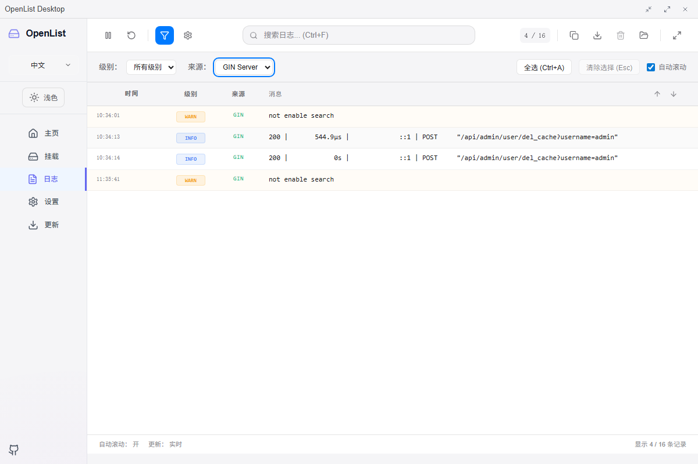

# OpenList Desktop

## OpenList Desktop 是什么

OpenList Desktop 是一个跨平台桌面应用程序，为管理 OpenList 和通过 Rclone 进行本地挂载提供用户友好的界面。基于 Vue 3、Tauri 和 Rust 构建，是一个全面的解决方案，用于：

- 管理 OpenList 核心

- 挂载和管理云存储（WebDAV）

- 监控服务运行状态

- 提供系统托盘集成以进行后台操作

仓库地址: [OpenListTeam/OpenList-Desktop](https://github.com/OpenListTeam/OpenList-Desktop)

## 功能特性

### 核心功能

- **OpenList 服务管理：** 启动、停止和监控 OpenList 核心

- **本地挂载：** 通过 Rclone 挂载至本地文件系统

- **实时监控：** 跟踪服务状态、运行时间和性能指标

- **日志管理：** 查看和管理 OpenList 和 Rclone 日志

- **系统托盘：** 带系统托盘通知的后台操作

### 管理功能

- **服务控制：** 启动/停止/重启 OpenList 和 Rclone 服务

- **配置管理：** 基于 GUI 的服务配置

- **日志监控：** 实时日志查看和管理

- **更新管理：** 自动更新检查和安装

- **自动启动：** 配置应用程序与系统一起启动

## 应用截图

### 主页仪表板



主仪表板提供您的 OpenList Desktop 环境的全面概览：

- OpenList 后台状态监控

- 常见任务的快速操作按钮

- OpenList 和 Rclone 版本管理

- 服务管理控制

### 挂载管理



轻松进行本地挂载：

- 添加和配置存储远程

- 挂载/卸载云存储

- 监控挂载状态和统计信息

- 配置自动挂载选项

### 日志管理



管理多个来源的日志：

- OpenList 日志

- Rclone 日志

- 应用程序日志

- 过滤和搜索日志

- 实时日志更新

- 导出日志到文件和剪贴板

## 安装

### 系统要求

- **操作系统：** Windows 10+、macOS 10.15+ 或 Linux（Ubuntu 18.04+）

### 下载选项

#### GitHub 发行版（推荐）

从 [GitHub Releases](https://github.com/OpenListTeam/OpenList-Desktop/releases) 下载最新版本：

- Windows：`OpenList-Desktop_x.x.x_{arch}-setup.exe`

- macOS：`OpenList-Desktop_x.x.x_{arch}.dmg`

- Linux：`OpenList-Desktop_x.x.x_{arch}.deb` 或 `OpenList-Desktop_x.x.x_{arch}.rpm`
  使

#### 用包管理器

##### Windows - Winget

```bash
winget install OpenListTeam.OpenListDesktop
```

### 安装步骤

#### Windows

1. 下载 `.exe` 安装程序

2. 以管理员身份运行安装程序

3. 按照安装向导进行操作

4. 从开始菜单或桌面快捷方式启动

#### macOS

1. 下载 `.dmg` 文件

2. 打开 DMG 并将 OpenList Desktop 拖到应用程序文件夹

3. 右键单击并选择"打开"（仅首次）

4. 在提示时授予必要权限

#### Linux

1. 下载 `.deb` 或 `.rpm` 包

2. 使用包管理器安装：

```bash
# Debian/Ubuntu 系统
sudo dpkg -i OpenList-Desktop_x.x.x_amd64.deb

# CentOS/RHEL/Fedora 系统
sudo rpm -i OpenList-Desktop_x.x.x_amd64.rpm
```

## 开始使用

### 首次启动

1. **Initial Setup:** On first launch, the application will guide you through initial configuration

2. **Service Installation:** Install the OpenList service when prompted

3. **Storage Configuration:** Configure your first cloud storage connection

::: tip
建议在首次启动时通过管理员权限运行 OpenList Desktop，以确保正确安装和配置服务。
:::

1. **初始设置：** 首次启动时，应用程序将指导您完成初始配置

2. **服务安装：** 在提示时安装 OpenList 服务

3. **存储配置：** 配置您的第一个云存储连接

### 基本操作

#### 启动服务

1. 导航到 **仪表板** 选项卡

2. 在快速操作中点击 **启动 OpenList 核心**

3. 如需要，点击 **启动 Rclone 后端**

#### 添加云存储

1. 导航到 **挂载** 选项卡

2. 点击 **添加远程** 按钮

3. 配置存储设置：

- **名称：** 存储的唯一标识符

- **类型：** 存储提供商（WebDAV）

- **URL：** 存储端点 URL

- **凭据：** 用户名和密码

- **挂载点：** 本地目录路径

4. 点击 **保存** 和 **挂载**

#### 监控操作

- **服务状态：** 检查仪表板上的服务健康指示器

- **日志：** 使用日志选项卡监控系统操作

- **性能：** 在仪表板上查看运行时间和响应指标

### 高级功能

#### 自动挂载配置

配置存储在启动时自动挂载，使用自定义 Rclone 标志以获得最佳性能：

- `--vfs-cache-mode=full`：启用完整 VFS 缓存

- `--buffer-size=256M`：增加缓冲区大小

- `--transfers=10`：并发传输限制

#### 系统托盘操作

- **右键单击托盘图标** 进行快速操作

- **双击** 显示/隐藏主窗口

- **后台操作** 带通知功能

## 配置

### 应用程序设置

访问全面的设置管理，包括：

- **OpenList 核心配置：** 端口、数据目录、自动启动设置

- **启动偏好设置：** 自动启动和自动化选项

- **主题和语言：** UI 自定义选项

- **更新设置：** 自动更新偏好设置

## 故障排除

### 常见问题

- **服务无法启动：** 检查端口是否可用并以管理员身份运行

- **挂载失败：** 验证存储凭据和网络连接

- **性能问题：** 调整 Rclone 缓存设置和缓冲区大小

- **更新问题：** 检查网络连接和代理设置

## 从源码构建

对于想要从源码构建的开发者：

```bash
# 克隆仓库
git clone https://github.com/OpenListTeam/OpenList-Desktop.git
cd openlist-desktop

# 安装依赖
yarn install

# 准备开发环境
yarn run prebuild:dev

# 开发模式
yarn tauri dev

# 构建应用程序
yarn run build
yarn run tauri build
```
