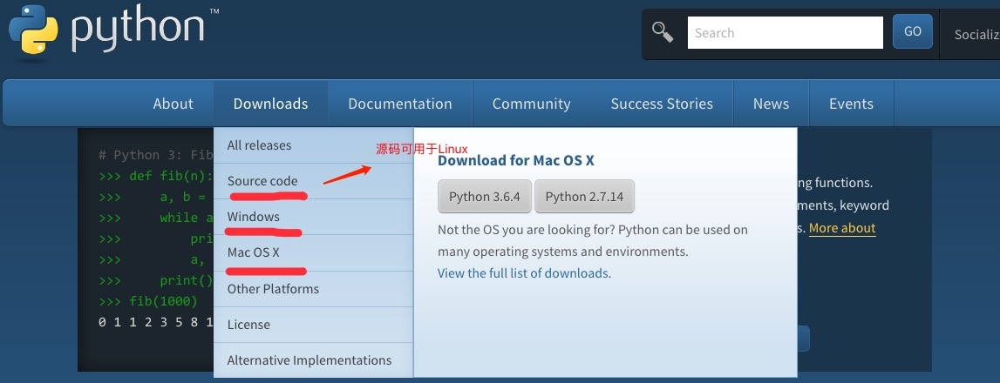
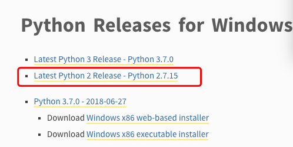
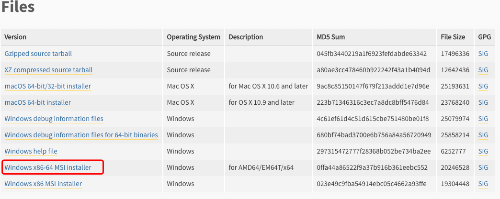

# Python 基础教程

> Python 是一种解释型、面向对象、动态数据类型的高级程序设计语言。
> Python 由 Guido van Rossum 于 1989 年底发明，第一个公开发行版发行于 1991 年。
> 像 Perl 语言一样, Python 源代码同样遵循 GPL(GNU General Public License) 协议。
> **官方宣布，2020 年 1 月 1 日， 停止 Python 2 的更新。** > **Python 2.7 被确定为最后一个 Python 2.x 版本。**

## Python 简介

Python 是一个高层次的结合了解释性、编译性、互动性和面向对象的脚本语言。

Python 的设计具有很强的可读性，相比其他语言经常使用英文关键字，其他语言的一些标点符号，它具有比其他语言更有特色语法结构。

- **Python 是一种解释型语言：** 这意味着开发过程中没有了编译这个环节。类似于 PHP 和 Perl 语言。

- **Python 是交互式语言：** 这意味着，您可以在一个 Python 提示符 `>>>` 后直接执行代码。

- **Python 是面向对象语言：** 这意味着 Python 支持面向对象的风格或代码封装在对象的编程技术。

- **Python 是初学者的语言：** Python 对初级程序员而言，是一种伟大的语言，它支持广泛的应用程序开发，从简单的文字处理到 WWW 浏览器再到游戏。

### Python 发展历史

Python 是由 Guido van Rossum 在八十年代末和九十年代初，在荷兰国家数学和计算机科学研究所设计出来的。

Python 本身也是由诸多其他语言发展而来的,这包括 ABC、Modula-3、C、C++、Algol-68、SmallTalk、Unix shell 和其他的脚本语言等等。

像 Perl 语言一样，Python 源代码同样遵循 GPL(GNU General Public License)协议。

现在 Python 是由一个核心开发团队在维护，Guido van Rossum 仍然占据着至关重要的作用，指导其进展。

Python 2.7 被确定为最后一个 Python 2.x 版本，它除了支持 Python 2.x 语法外，还支持部分 Python 3.1 语法。

### Python 特点

1. **易于学习：** Python 有相对较少的关键字，结构简单，和一个明确定义的语法，学习起来更加简单。

2. **易于阅读：** Python 代码定义的更清晰。

3. **易于维护：** Python 的 成功在于它的源代码是相当容易维护的。

4. **一个广泛的标准库：** Python 的最大的优势之一是丰富的库，跨平台的，在 UNIX、Windows 和 Mac 兼容很好。

5. **互动模式：** 互动模式的支持，您可以从终端输入执行代码并获得结果的语言，互动的测试和调试代码片段。

6. **可移植：** 基于其开放源代码的特性，Python 已经被移植（也就是使其工作）到许多平台。

7. **可扩展：** 如果你需要一段运行很快的关键代码，或者是想要编写一些不愿开放的算法，你可以使用 C 或 C++ 完成那部分程序，然后从你的 Python 程序中调用。

8. **数据库：** Python 提供所有主要的商业数据库的接口。

9. **GUI 编程：** Python 支持 GUI 可以创建和移植到许多系统调用。

10. **可嵌入：** 你可以将 Python 嵌入到 C/C++ 程序，让你的程序的用户获得"脚本化"的能力。

### Python 环境搭建

Python 是一种跨平台的编程语言，能够在多种操作系统上运行。

本章节我们将向大家介绍如何在本地搭建 Python 开发环境。

Python 可应用于多平台，包括 Windows、Linux 和 Mac OS X。

你可以通过终端窗口输入 `python` 命令来查看本地是否已经安装 Python 以及 Python 的安装版本。

- Windows：包括 Windows 7 及以上版本。

- macOS：适用于所有主流 macOS 版本。

- Linux：几乎所有主流 Linux 发行版，如 Ubuntu、Debian、Fedora、CentOS 等。

- Unix：支持类 Unix 系统，如 FreeBSD、OpenBSD 等。

- 嵌入式系统：如 Raspberry Pi 等设备。

- 移动平台：通过特定框架（如 Kivy）支持 iOS 和 Android。

- 云平台：支持 AWS、Google Cloud、Azure 等云服务环境。

#### Python 下载

Python 最新源码，二进制文档，新闻资讯等可以在 Python 的官网查看到：

Python 官网：[https://www.python.org/](https://www.python.org/)

你可以在以下链接中下载 Python 的文档，你可以下载 HTML、PDF 和 PostScript 等格式的文档。

Python 文档下载地址：[https://www.python.org/doc/](https://www.python.org/doc/)

#### Python 安装

Python 已经被移植在许多平台上（经过改动使它能够工作在不同平台上）。

您需要下载适用于您使用平台的二进制代码，然后安装 Python。

如果您平台的二进制代码是不可用的，你需要使用 C 编译器手动编译源代码。

编译的源代码，功能上有更多的选择性， 为 python 安装提供了更多的灵活性。

以下是各个平台安装包的下载地址：

以下为不同平台上安装 Python 的方法：

##### Unix & Linux 平台安装 Python:

以下为在 Unix & Linux 平台上安装 Python 的简单步骤：

- 打开 WEB 浏览器访问[https://www.python.org/downloads/source/](https://www.python.org/downloads/source/)

- 选择适用于 Unix/Linux 的源码压缩包。

- 下载及解压压缩包。

- 如果你需要自定义一些选项修改 Modules/Setup

- 执行 ./configure 脚本

- make

- make install

执行以上操作后，Python 会安装在 /usr/local/bin 目录中，Python 库安装在 /usr/local/lib/pythonXX，XX 为你使用的 Python 的版本号。

##### Window 平台安装 Python:

以下为在 Window 平台上安装 Python 的简单步骤：

- 打开 WEB 浏览器访问[https://www.python.org/downloads/windows/](https://www.python.org/downloads/windows/)

- 在下载列表中选择 Window 平台安装包，包格式为：python-XYZ.msi 文件 ， XYZ 为你要安装的版本号。

- 要使用安装程序 python-XYZ.msi, Windows 系统必须支持 Microsoft Installer 2.0 搭配使用。只要保存安装文件到本地计算机，然后运行它，看看你的机器支持 MSI。Windows XP 和更高版本已经有 MSI，很多老机器也可以安装 MSI。

- 下载后，双击下载包，进入 Python 安装向导，安装非常简单，你只需要使用默认的设置一直点击"下一步"直到安装完成即可。

##### MAC 平台安装 Python:

MAC 系统一般都自带有 Python2.x 版本 的环境，你也可以在链接 [https://www.python.org/downloads/mac-osx/](https://www.python.org/downloads/mac-osx/) 上下载最新版安装。

#### 环境变量配置

...
